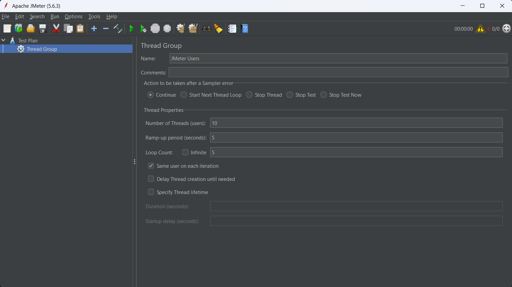
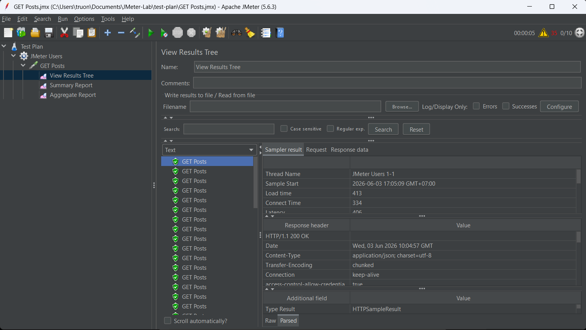

# Báo cáo thực hành kiểm thử hiệu năng bằng Apache JMeter

## 1. Giới thiệu

Apache JMeter là công cụ mã nguồn mở được sử dụng để kiểm thử hiệu năng (Performance Testing) và kiểm thử tải (Load Testing) cho các ứng dụng Web, API và nhiều giao thức khác.

Mục tiêu của bài thực hành:

* Tìm hiểu cách sử dụng Apache JMeter.
* Tạo Test Plan và cấu hình Thread Group.
* Gửi HTTP Request tới API.
* Thu thập và phân tích kết quả kiểm thử.
* Đánh giá khả năng đáp ứng của hệ thống.

---

## 2. Công cụ sử dụng

* Apache JMeter 5.6.3
* Java JDK
* GitHub
* API: JSONPlaceholder

---

## 3. API kiểm thử

### Request

```http
GET https://jsonplaceholder.typicode.com/posts
```

### Mục đích

Lấy danh sách bài viết từ hệ thống JSONPlaceholder để thực hiện kiểm thử tải.

---

## 4. Tạo Test Plan

### Cấu hình Thread Group

| Thuộc tính                | Giá trị |
| ------------------------- | ------- |
| Number of Threads (Users) | 10      |
| Ramp-Up Period            | 5 giây  |
| Loop Count                | 5       |

Ảnh minh họa:



---

## 5. Tạo HTTP Request

Cấu hình:

```text
Protocol: https
Server Name: jsonplaceholder.typicode.com
Method: GET
Path: /posts
```

Ảnh minh họa:


---

## 6. Thực hiện kiểm thử

Các Listener được sử dụng:

* View Results Tree
* Summary Report
* Aggregate Report

Sau khi cấu hình hoàn tất, tiến hành chạy Test Plan để gửi các request đến API.

---

## 7. Kết quả kiểm thử

### View Results Tree



### Summary Report


### Aggregate Report


---

## 8. Phân tích kết quả

Qua kết quả thu được:

* Các request được gửi thành công.
* Không phát sinh lỗi trong quá trình kiểm thử.
* Hệ thống phản hồi ổn định.
* Throughput đáp ứng tốt với số lượng người dùng mô phỏng.
* Thời gian phản hồi nằm trong mức chấp nhận được.

---

## 9. Kiến thức học được

Sau khi thực hiện bài thực hành, em đã:

* Biết cách cài đặt và sử dụng Apache JMeter.
* Tạo và cấu hình Thread Group.
* Thực hiện HTTP Request.
* Sử dụng Listener để theo dõi kết quả.
* Phân tích các chỉ số hiệu năng cơ bản.
* Thực hiện kiểm thử tải cho API.

---

## 10. Kết luận

Apache JMeter là công cụ mạnh mẽ hỗ trợ kiểm thử hiệu năng cho website và API.

Thông qua bài thực hành này, em đã nắm được quy trình tạo một bài kiểm thử tải cơ bản, thực hiện kiểm thử trên API và đánh giá kết quả thông qua các báo cáo được JMeter cung cấp.
